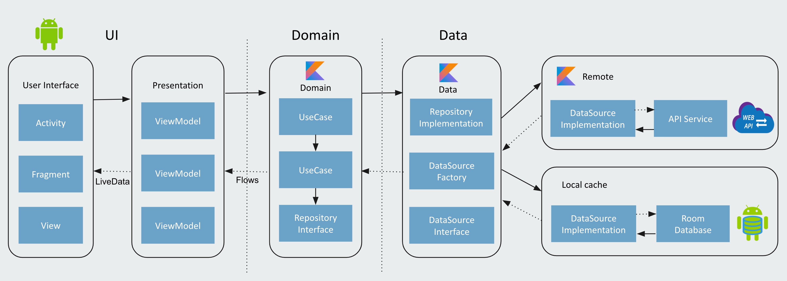

[GitHub](https://github.com/DavidVegaC/Challenge-Apex/)

# Informe Técnico: Desarrollo de Aplicación Android

[Challenge](https://drive.google.com/file/d/1bdWs-nwdLCCaRn5k-8UbJcLRx5MNewUo/view) - Challenge Instructions

La aplicación consume una API de recetas, una API creada con mock api.io. Esta aplicación nos mostrar recetas, entrar en detalle y finalmente mostarr su ubicación.
El objetivo del proyecto es crear una aplicación modularizada utilizando Jetpack Compose, MVVM + MVI y Clean Architecture. Así como el uso de una arquitectura modular, respetando los principios SOLID. Nos permite almacenar las respuestas de la API en una base de datos local, lo cual nos permite trabajar sin conexión con estos datos (caché). Estas decisiones garantizan la escalabilidad, la inyección de dependencias y la realización de pruebas unitarias.

### Screenshots

## Arquitectura y Patrones de Diseño

### Arquitectura en Capas

- **Capa de Presentación:**
  Se implementó Jetpack Compose en conjunción con los patrones  MVI y MVVM. Esto facilita la separación de la lógica de la interfaz de usuario, manteniendo una clara división de responsabilidades.

- **Capa de Dominio:**
  En esta capa residen las reglas de negocio, los Use Cases y las Entities. Este enfoque permite mantener la independencia entre las capas superior e inferior.

- **Capa de Datos:**
  La gestión de acceso a datos se realizó mediante Repositories y Data Sources, proporcionando flexibilidad al cambiar las fuentes de datos, ya sea una API o una base de datos local.

### Patrones Utilizados

- **MVI (Model-View-Intent):**  
  Con un flujo unidireccional de datos, los eventos y acciones del usuario siguen un camino predecible, desde la Vista hasta el ViewModel, simplificando las pruebas unitarias y la gestión del estado de la aplicación.

- **MVVM (Model-View-ViewModel):** Este patrón facilita la separación de la lógica de la interfaz de usuario de los datos subyacentes, mejorando la mantenibilidad del código.

## Funcionalidades Destacadas

La aplicación se destaca por:

- **Almacenamiento Local con Room:**
  Utilización de Room para almacenar localmente las recetas. Esta estrategia minimiza las llamadas al servidor, optimizando la experiencia del usuario y reduciendo el consumo de datos móviles.

- **Actualización de Datos desde el Servidor:**
  Se implementó un botón que permite a los usuarios actualizar los datos desde el servidor, de forma manual.

## Seguridad

Se implementaron medidas de seguridad como:

- **Ofuscación de Código:** Configurada para la compilación en modo release, dificultando la comprensión del código descompilado.

## Librerías Utilizadas

La aplicación se basa en las siguientes librerías:

- [**Kotlin**](https://kotlinlang.org/ "https://kotlinlang.org/")

- **[**Jetpack Compose**](https://developer.android.com/jetpack/compose?hl=es-419):** Framework moderno para el desarrollo de interfaces de usuario.
    -   [Room](https://developer.android.com/topic/libraries/architecture/room "https://developer.android.com/topic/libraries/architecture/room")  - Abstracción que simplifica la administración de bases de datos SQLite en Android.
    - [Compose Navigation](https://developer.android.com/jetpack/compose/navigation?hl=es-419) - Gestión eficiente de la navegación entre Composables, permitiendo el desarrollo de aplicaciones con una sola Activity.

    -   [Compose](https://developer.android.com/jetpack/compose "https://developer.android.com/jetpack/compose")  - Se utiliza para construir interfaces de usuario de manera declarativa.

- [**Flow:**](https://kotlin.github.io/kotlinx.coroutines/kotlinx-coroutines-core/kotlinx.coroutines.flow/)  Flow se utiliza para pasar (enviar) un flujo de datos que se pueden calcular de forma asíncrona.

- [**Coroutines:**](https://github.com/Kotlin/kotlinx.coroutines)  Una corrutina es un patrón de diseño de concurrencia que se puede utilizar en Android para simplificar el código que se ejecuta de forma asíncrona.

- **[Dagger-Hilt:](https://developer.android.com/training/dependency-injection/hilt-android "https://developer.android.com/training/dependency-injection/hilt-android")** Librería de inyección de dependencias que reduce el trabajo manual de inserción de dependencias.

- **[Coil:](https://coil-kt.github.io/coil/)** Potente librería para la carga eficiente de imágenes, con almacenamiento en caché para mejorar la velocidad de carga.

- **[Retrofit](https://github.com/square/retrofit "https://github.com/square/retrofit"):** Facilita las peticiones HTTP de manera simplificada.

    - [OkHttp](http://square.github.io/okhttp/ "http://square.github.io/okhttp/") - Un cliente HTTP que sea eficiente por defecto: el soporte para HTTP/2 permite que todas las solicitudes al mismo host compartan un socket.

    - [Gson](https://github.com/square/retrofit/tree/master/retrofit-converters/gson "https://github.com/square/retrofit/tree/master/retrofit-converters/gson") - Se utiliza para convertir objetos Java en su representación JSON y viceversa.

- **[Mockk](https://github.com/mockk/mockk "https://github.com/mockk/mockk"):** Herramientas esenciales para el desarrollo de pruebas unitarias.

-   [**Androidx-core**](https://androidx.tech/artifacts/arch.core/core-testing/ "https://androidx.tech/artifacts/arch.core/core-testing/")  - Allows working with LiveData in order to create dispatcher

- **Gradle Version Catalogs:** Estandariza y facilita la gestión de dependencias en diferentes módulos.

## Conclusiones

El proyecto se desarrolló con un enfoque en las mejores prácticas actuales, priorizando la modularización, seguridad y eficiencia. La implementación de una arquitectura limpia, patrones de diseño claros y medidas de seguridad robustas ha fortalecido la aplicación en términos de mantenibilidad y estabilidad.